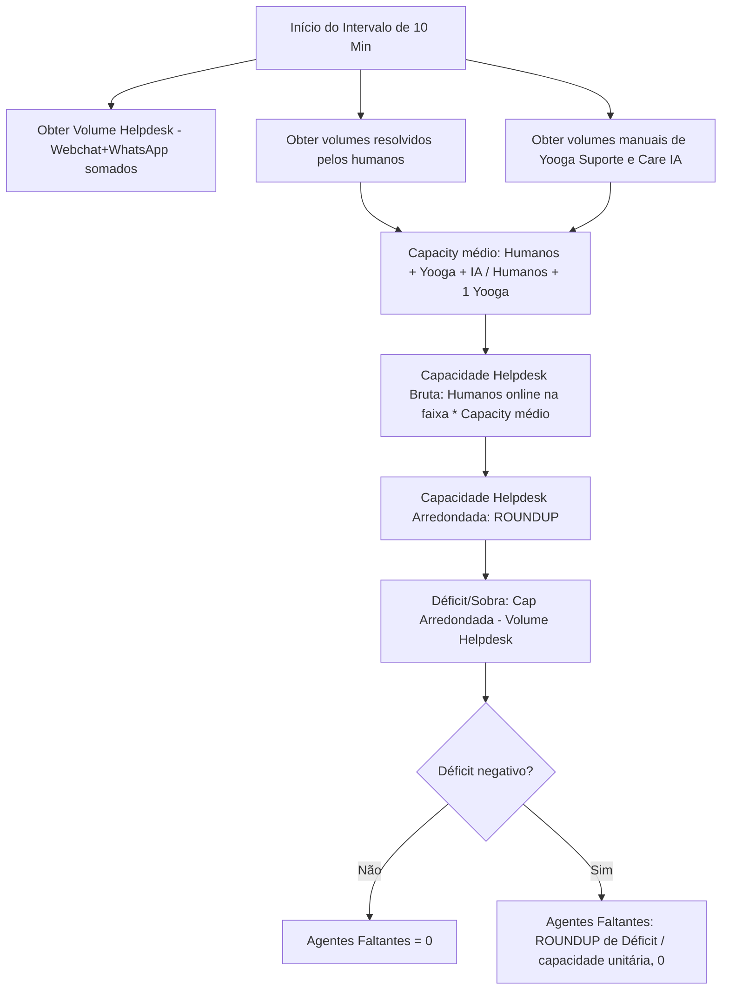

# Guia Técnico de Dimensionamento - Canal Único (Helpdesk)

> **Yooga — Planejamento Operacional e Inteligência de Atendimento**
> Versão: 2.1 (Setembro/2026)
> Substitui o modelo de duas filas descrito em `DOCUMENTACAO_DIMENSIONAMENTO.md` (v1.0), que passa a valer como **registro histórico/legado**.

---

## 1. Motivação da Mudança

A Yooga está migrando de plataforma de atendimento. Na plataforma anterior, Webchat e WhatsApp chegavam como filas separadas, o que justificava o modelo de **overflow** (agente ocioso do Webchat "empresta" capacidade pro WhatsApp). Na plataforma nova, **não existe mais separação de canal** — todo chamado (era Webchat ou WhatsApp) cai numa fila única.

Consequência direta pra regra de negócio:

- **Não existe mais Capacity WhatsApp.** A métrica e a coluna somem do modelo.
- **Não existe mais overflow/transbordo entre filas.** Não há "sobra do canal A" pra liberar agente pro canal B, porque só existe um canal.
- Nasce a métrica **Capacity Helpdesk**: capacidade total do time pra atender a fila única, em blocos de 10 minutos.

---

## 2. O que muda vs. o que não muda

| Item                                              | Modelo v1 (Webchat + WhatsApp)                                                  | Modelo v2 (Helpdesk único)                                             |
| :------------------------------------------------ | :------------------------------------------------------------------------------ | :--------------------------------------------------------------------- |
| Filas de atendimento                              | 2 (Webchat prioritário, WhatsApp overflow)                                      | 1 (Helpdesk)                                                           |
| Volume de chamados                                | Somado separado por aba/canal                                                   | **Somado único** (volume Webchat + volume WhatsApp viram um volume só) |
| Granularidade de cálculo                          | Blocos de 10 min                                                                | **Mantém blocos de 10 min**                                            |
| Simultâneos por agente                            | 3 (Webchat) / 4 (WhatsApp)                                                      | **3 simultâneos** (mesmo valor do antigo Webchat)                      |
| Capacidade unitária por dia da semana             | Tabela por dia (seg 1.63, ter 1.67, qua 2.70, qui/sex 1.33, sáb 1.64, dom 1.76) | **Mesma tabela, sem alteração** (a fórmula já usava 3 simultâneos)     |
| Lógica de transbordo (overflow)                   | Sim — sobra do Webchat vira agente disponível pro WhatsApp                      | **Removida**                                                           |
| Déficit → agentes faltantes                       | `ROUNDUP(déficit / -4, 0)` (WhatsApp, 4 simultâneos)                            | `ROUNDUP(déficit / -capacidade unitária, 0)` — ver seção 3.6           |
| Capacity/Tag (segmentação por assunto)            | Existe                                                                          | **Sem alteração** — continua existindo como está hoje                  |
| Regras de escala 5x2, folgas, teto de contratação | Existem (Seção 5 do doc v1)                                                     | **Sem alteração**                                                      |

---

## 3. Metodologia de Cálculo — Capacity Helpdesk

Sem mais duas filas, o cálculo fica mais direto: capacidade do time inteiro contra o volume total (único) do bloco de 10 minutos.

### 3.1 Capacidade Unitária Helpdesk (por dia da semana)

O Capacity médio considera todo o volume resolvido, mas somente posições operacionais humanas no divisor:

$$\text{Capacity}_{dia} = \frac{\sum \text{Resolvidos Humanos/10min} + \text{Yooga/10min} + \text{Care IA/10min}}{\text{Quantidade de Humanos} + 1 \text{ Yooga}}$$

- **Yooga Suporte** representa supervisores + N2: seu volume entra no numerador e ele soma uma posição ao divisor.
- **Care IA** tem o volume incluído no numerador, mas nunca entra como agente ou posição no divisor.
- O resultado é truncado em duas casas decimais para não superestimar a capacidade.

Exemplo da terça-feira: `(3,4483 humanos + 1 Yooga + 1,1340 IA) ÷ (6 humanos + 1 Yooga) = 0,7974`, resultando em **0,79**.

### 3.2 Capacidade Helpdesk Bruta

$$\text{Capacidade Bruta}_{t} = \text{Agentes Humanos Online}_{t} \times \text{Capacity}_{dia}$$

Os dois volumes são informados manualmente na tabela de Capacity e convertidos em capacidade média por bloco de 10 minutos:

- **Yooga Suporte:** `mediaTri ÷ 3 meses ÷ 20 dias úteis ÷ 8 horas ÷ 6 blocos`.
- **Care IA:** `mediaTri ÷ 3 meses ÷ 30 dias ÷ 24 horas ÷ 6 blocos`.

Os volumes entram na composição do Capacity diário. Na grade por faixa, somente os agentes humanos marcados como `trabalhando` na escala multiplicam esse fator. Care IA e Yooga Suporte não são acrescentados novamente como agentes online.

### 3.3 Capacidade Helpdesk Arredondada

$$\text{Cap Arredondada}_{t} = \text{ROUNDUP}(\text{Capacidade Bruta}_{t}, 0)$$

### 3.4 Volume Helpdesk

Passa a ser a soma do que antes eram dois volumes separados:

$$\text{Volume Helpdesk}_{t} = \text{Volume Webchat}_{t} + \text{Volume WhatsApp}_{t}$$

> Na prática operacional, a plataforma nova já entrega esse volume somado — não é mais necessário somar manualmente duas fontes.

### 3.5 Déficit / Sobra

$$\text{Déficit}_{t} = \text{Cap Arredondada}_{t} - \text{Volume Helpdesk}_{t}$$

- Resultado positivo = sobra de capacidade (sem ação).
- Resultado negativo = déficit (precisa cobrir com agente).

### 3.6 Agentes Faltantes

O déficit está em **chamados**; converter em agentes exige dividir pelo que um agente resolve no bloco — ou seja, pela **mesma Capacidade Unitária da seção 3.1**:

$$\text{Agentes Faltantes}_{t} = \text{ROUNDUP}\left(\frac{\text{Déficit}_{t}}{-\text{Capacidade Unitária}}, 0\right)$$

Se o déficit for positivo (sobra), a fórmula resulta em zero ou negativo — tratado como "zero agentes faltantes", igual ao modelo v1.

> **Correção vs. a v2.0 desta doc (e vs. todo o modelo v1).** A versão anterior dividia por **3** (os simultâneos) em vez da capacidade unitária. Como a capacidade unitária **já embute os 3 simultâneos** (seção 3.1), os simultâneos entravam duas vezes e o número de agentes faltantes saía subestimado em `3 / capacidade unitária` — com os fatores atuais, ~1,8x menos gente do que o necessário. Sintoma prático: contratar exatamente o que o painel pedia **não zerava o déficit** na Prova Real. Exemplo com 2 agentes, capacidade unitária 1,63 e volume 10 no bloco:
>
> |                                 | Modelo antigo (`/3`) | Corrigido (`/1,63`) |
> | :------------------------------ | :------------------- | :------------------ |
> | Capacidade arredondada          | 4                    | 4                   |
> | Déficit                         | -6                   | -6                  |
> | Agentes faltantes               | 2                    | 4                   |
> | Déficit após contratar o pedido | -3 (ainda falta)     | 0                   |
>
> **Esperado:** todo número de contratação (Painel, Prova Real, Contratações, export Excel) sobe. Não é inflação do modelo — é a conta que o modelo antigo devia desde a v1.

---

## 4. O que é removido do modelo v1

- Aba/lógica `Fevereiro-26-Whatsapp` e sua capacidade unitária derivada (`Capacidade Unitária Webchat × 4/3`).
- Coluna "Agentes Disponíveis para WhatsApp" (overflow) — sem propósito sem segunda fila.
- Métrica **Capacity/Whats** na UI (`AgentCapacity.tsx` e abas diárias que hoje mostram `Capacity/Webchat` e `Capacity/Whats`).
- Rotas/abas separadas `webchat` e `whatsapp` como filas distintas — viram uma fila `helpdesk` única (ver Seção 6).

## 5. O que NÃO muda

- Blocos de 10 minutos como granularidade de cálculo.
- Regime de atendimento 07:00–03:00 (20h/dia).
- Regras de escala 5x2, janela de folga (sábado a terça), proibição de fim de semana consecutivo — Seção 5 do doc v1 continua valendo integralmente.
- Teto de 6 agentes no time e limite de 4 contratações/mês.
- Capacity/Tag (segmentação por Periféricos, Pagamentos, Fiscal & Dash, App) e sua regra de fallback (mínimo 4 agentes ativos) — continuam existindo como estão hoje, fora do escopo desta mudança.
- Aba `Prova Real-Contratações` — mesma lógica de simulação, só que aplicada em cima do Helpdesk único em vez do WhatsApp.

## 5.1 Cobertura noturna fixa durante a migração

Enquanto a migração do Freshchat para o HubSpot estiver ativa, o Helpdesk segue uma regra de escala fixa na madrugada. A consolidação só deve ser encerrada após confirmação operacional, sem corte automático por data:

- **Terça a sábado:** atendimento até 03:00; das 00:00 às 03:00 o requisito é exatamente **1 agente humano**.
- **Domingo e segunda:** atendimento até 01:00; das 00:00 às 01:00 o requisito é exatamente **1 agente humano**.
- O turno de fechamento de referência é **18:00–03:00**, realizado por Maria Luiza nos dias aplicáveis.
- Essa posição é conferida pela grade de escala, mas não é convertida em pedido de contratação pela Prova Real, IA ou otimizador. As novas contratações podem terminar, no máximo, às **00:00**.

Durante a migração, os volumes e capacities humanos de Freshchat e HubSpot permanecem consolidados. Os volumes trimestrais de **Yooga Suporte** e **Care IA** são premissas manuais: a sincronização não pode substituí-los.

---

## 6. Impacto no código (referência, não escopo desta doc)

Pontos do projeto que hoje modelam a lógica v1 e vão precisar de revisão quando a migração de plataforma for implementada:

- `src/routes/webchat.tsx` / `whatsapp.tsx` — filas separadas.
- `src/lib/api/sync-capacity.server.ts` — sincronização de capacity, hoje provavelmente separada por canal.
- `src/components/AgentCapacity.tsx` — exibe `Capacity/Webchat` e `Capacity/Whats` como métricas distintas.
- `src/context/DimensionamentoContext.tsx` (`dynamicTmaFactors`) — calcula fator Webchat e deriva Whats por `×4/3`; overflow removido, fator vira direto "Helpdesk".

> Esta documentação cobre só a **regra de negócio**. Implementação no código é tarefa separada.

---

## 8. Ajustes de implementação (Setembro/2026, v2.1)

Correções aplicadas ao motor (`src/lib/calculations.ts`) depois da auditoria da fila única. As três primeiras mudam número na tela.

| #   | Mudança                                                                                   | Efeito                                                                                                   |
| :-- | :---------------------------------------------------------------------------------------- | :------------------------------------------------------------------------------------------------------- |
| 1   | **Agentes faltantes divide pela capacidade unitária**, não pelos simultâneos (seção 3.6). | Contratação pedida sobe ~1,8x e passa a zerar o déficit de fato.                                         |
| 2   | **`ROUNDUP` removido dos resolvidos/dia** por agente.                                     | Capacidade cai ~4%; déficit sobe na mesma proporção.                                                     |
| 3   | **Knob de simultâneos escala a capacidade unitária.**                                     | Mexer nos simultâneos agora muda capacidade E déficit, como manda a seção 3.1. Em 3 (padrão), nada muda. |
| 4   | KPIs `horasOciosas` e `excedenteTotal` e a coluna `Faltam 20min` removidos.               | Nenhum — não eram exibidos em lugar nenhum.                                                              |

**Detalhe do item 2.** A capacidade por agente vem do histórico de resolvidos (`mediaTri ÷ 3 meses ÷ 20 dias úteis ÷ 8h ÷ 6 blocos`). O passo "÷ 20 dias" arredondava **pra cima** o resultado, inflando a média diária de cada agente em até 1 chamado — arredondar pra cima uma média não tem justificativa operacional e sempre puxava o dimensionamento pra menos gente. Removido. A tabela da seção 3.1 continua sendo a referência de negócio; os fatores efetivos do app são calculados por agente a partir do histórico real.

**Detalhe do item 4.** `horasOciosas` dividia a sobra de **chamados** por 6 e rotulava o resultado como horas de agente ocioso — unidades trocadas. Nenhuma tela consumia o valor, então foi removido em vez de corrigido. `Faltam 20min` não tem definição nesta doc e também não era renderizado.

**Composição do Capacity na fila única.** Os volumes manuais de Yooga Suporte e Care IA entram no numerador do fator médio. O divisor contém os humanos escalados e uma posição agregada de Yooga Suporte; Care IA não entra no divisor. A demanda permanece bruta.
